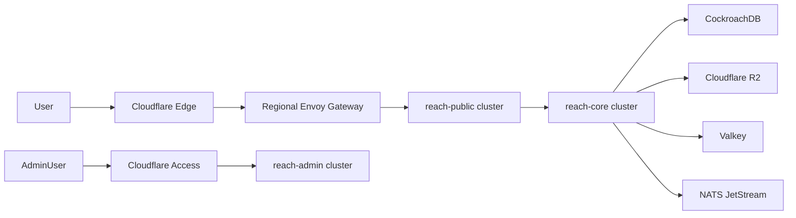

# Reach Production Architecture Blueprint

## 1. Purpose

This document defines the first production architecture for Reach as a serious, global, privacy-first messaging platform. It is intentionally opinionated. The goal is to remove ambiguity before implementation starts.

Reach is not being designed as a general social network. It is a privacy-native communication platform that combines:

- end-to-end encrypted direct messaging
- small private groups and later large MLS-backed groups
- pseudonymous, community-scoped identity
- disappearing messages and self-destruct flows
- privacy-preserving trust, moderation, and abuse response

## 2. Architectural Principles

### 2.1 Non-negotiable rules

1. Message plaintext never leaves client trust boundaries.
2. Media is encrypted on-device before upload.
3. Phone number is optional and never the sole account root.
4. Each device has its own trust identity and key material.
5. The web client is a secondary client, not the primary trust anchor.
6. Redis or Valkey is used only for ephemeral state, never durable truth.
7. Server-side analytics must be aggregated and privacy-scrubbed.
8. No plaintext message bodies, attachment URLs, or secret material may appear in logs, traces, or metrics labels.

### 2.2 System planes

Reach is split into four planes to prevent privacy-critical paths from collapsing into general product logic:

- Client plane: iOS, Android, web, later desktop
- Messaging and security plane: session setup, device keys, message transport, groups, encrypted media
- Control plane: identity, auth, usernames, moderation, trust, billing, admin
- Infrastructure plane: regions, storage, compute, observability, deployment, security operations

## 3. Technology Baseline

### 3.1 Client

- iOS: Swift, SwiftUI, selective UIKit, async/await, Keychain, Secure Enclave
- Android: Kotlin, Jetpack Compose, Coroutines, Flow, Android Keystore
- Web: Next.js, TypeScript, App Router, TanStack Query, Zustand

### 3.2 Backend

- Primary language: Rust
- HTTP: Axum
- Internal RPC: Tonic/gRPC
- Async runtime: Tokio
- Serialization: Serde
- DB access: SQLx

### 3.3 Data and infrastructure

- Transactional metadata store: CockroachDB
- Event backbone: NATS JetStream
- Ephemeral state: Valkey
- Object storage: Cloudflare R2 with S3-compatible interface
- Search: OpenSearch for internal/admin use only
- Edge: Cloudflare
- Runtime: Kubernetes
- IaC: Terraform + Helm + Argo CD
- Secrets: Vault plus cloud KMS

### 3.4 Crypto direction

- 1:1 messaging: libsignal-based device sessions
- Group roadmap: MLS, with OpenMLS as the primary candidate
- Key transparency: append-only auditable directory with inclusion and consistency proofs

## 4. Deployment Model

Reach should start as a modular monolith with strict package and storage boundaries, then extract services only where risk or scale justifies it.

### 4.1 What "modular monolith" means here

- Each service below maps to its own Rust workspace crate and its own schema ownership.
- Inter-module boundaries are enforced in code and documentation before deployment boundaries are added.
- Every module exposes clear API contracts, domain events, and storage ownership.
- Extraction to separate deployables happens only after a capacity, fault-isolation, or security reason exists.

## 5. Service Catalog

The service list below is the authoritative production target. In the first build, several services can be deployed together as one binary if boundaries remain intact.

| Service | Primary responsibility | Explicitly does not own | Primary storage | Main interfaces |
| --- | --- | --- | --- | --- |
| Edge Gateway | Public HTTP and WebSocket ingress, auth enforcement, request normalization, rate-limit context, regional routing hints | Token issuance, message storage, moderation logic | None | HTTPS, WebSocket |
| Identity Service | Account creation, account status, username lifecycle, optional phone/email binding, device inventory | Device key material, push dispatch, report review | `identity.*` | gRPC, internal HTTP |
| Auth Service | Access tokens, refresh rotation, session revocation, step-up auth, account recovery flows | Usernames, device public keys, message delivery | `auth.*` | gRPC, internal HTTP |
| Directory Service | Username resolution, scoped handle lookup, privacy-preserving discovery roadmap, alias search policies | Auth sessions, message fan-out | `directory.*` | gRPC |
| Key Service | Device identity keys, signed prekeys, one-time prekeys, key rotation metadata | Transparency proofs, account recovery | `keys.*` | gRPC |
| Transparency Service | Append-only key log, signed tree heads, inclusion proofs, auditor checkpoints, public verification exports | Prekey retrieval, session bootstrap logic | `transparency.*`, object snapshots | gRPC, export API |
| Messaging Ingress Service | Accept encrypted envelopes, validate sender/session state, assign message IDs, publish delivery jobs | Recipient websocket delivery, push notifications | `messaging_ingress.*`, JetStream streams | gRPC, NATS |
| Delivery Service | Recipient routing, online delivery, offline queue management, ack tracking, expiration enforcement | Group policy changes, spam investigation | `delivery.*`, Valkey routing keys | gRPC, WebSocket workers, NATS |
| Group Service | Group and community metadata, memberships, roles, invites, MLS epoch orchestration, scoped pseudonyms | Direct message delivery, push token storage | `groups.*` | gRPC, NATS |
| Media Service | Upload tickets, encrypted object manifests, retention lifecycle, malware scan orchestration, quota enforcement | Message plaintext, push notifications | `media.*`, R2 buckets | HTTPS, gRPC, NATS |
| Presence Service | Online status, typing indicators, ephemeral room state, last-seen policy enforcement | Durable account status, read receipts history | `presence.*`, Valkey | gRPC |
| Notification Service | APNs and FCM delivery, token hygiene, silent wake orchestration, suppression policies | Account identity, message storage | `notifications.*` | gRPC, provider APIs |
| Trust Service | Report intake, abuse evidence bundles, invite graph scoring, rate-control decisions, enforcement recommendations | Reading all user content by default | `trust.*`, OpenSearch indices | gRPC, NATS |
| Admin and Audit Service | Admin console APIs, audit trail, privileged approvals, operational search, compliance workflow | Core message routing, crypto state | `admin.*`, OpenSearch indices | HTTPS, gRPC |
| RTC Service | Call session setup, LiveKit room issuance, coturn credentials, call policy enforcement | Chat message transport, account lifecycle | `rtc.*` | HTTPS, gRPC |

### 5.1 Service boundary notes

- `Identity Service` owns who an account is.
- `Auth Service` owns how that account proves active session state.
- `Key Service` owns which device public keys are valid.
- `Transparency Service` owns whether clients can audit server honesty.
- `Messaging Ingress Service` owns accepting ciphertext.
- `Delivery Service` owns getting ciphertext to recipient devices.
- `Trust Service` owns enforcement logic, but only from user-submitted evidence, rate signals, and scoped metadata.

## 6. Core Data Flows

### 6.1 Account creation and device enrollment

1. Client creates local device identity and secure storage roots.
2. Identity Service creates an opaque account ID.
3. Auth Service issues short-lived access and rotating refresh credentials.
4. Key Service registers the device identity key and prekeys.
5. Transparency Service appends the new device key record.
6. Notification Service stores push token mapping for the device.

### 6.2 Direct message send

1. Sender resolves recipient devices through Directory Service and Key Service.
2. Sender establishes or advances libsignal sessions client-side.
3. Client encrypts payload locally and submits encrypted envelope to Messaging Ingress.
4. Messaging Ingress validates sender/session metadata and writes a delivery job to JetStream.
5. Delivery Service fans out per recipient device.
6. If device is online, Delivery Service emits over WebSocket.
7. If device is offline, Delivery Service stores a short-lived queue entry and asks Notification Service to issue a privacy-minimal wake event.

### 6.3 Group message send

1. Sender fetches current group epoch and membership state from Group Service.
2. Client encrypts to the current group state.
3. Messaging Ingress accepts ciphertext and tags it with group routing metadata only.
4. Delivery Service fans out based on current device membership snapshot.
5. Group changes are versioned separately from message delivery.

### 6.4 Media send

1. Client encrypts attachment locally and derives media key.
2. Media Service issues a short-lived upload ticket and manifest ID.
3. Client uploads encrypted blob directly to R2.
4. Media Service stores encrypted object metadata and retention policy.
5. Message payload contains only encrypted media references and key material wrapped end-to-end for recipients.

### 6.5 Abuse report

1. Reporter explicitly chooses messages, media references, or profiles to report.
2. Client builds a scoped evidence bundle.
3. Trust Service stores report metadata and encrypted or access-controlled evidence references.
4. Admin and Audit Service exposes the case to authorized reviewers only.
5. Enforcement decisions feed back to Identity, Group, and Delivery services through audited commands.

## 7. Database and Storage Domains

CockroachDB is the source of truth for durable product metadata. Valkey is ephemeral. R2 stores encrypted blobs. OpenSearch is internal-only.

### 7.1 CockroachDB schema domains

#### `identity`

- `accounts`: opaque account ID, lifecycle state, policy flags, deletion timestamps
- `usernames`: global username allocation, reservation state, release timing
- `profile_preferences`: non-sensitive display settings and discovery policy flags
- `devices`: device registry, platform, app version, attestation summary, enrollment state
- `account_contacts`: optional contact bindings and verification state
- `deletion_jobs`: self-destruct or account deletion workflows

#### `auth`

- `sessions`: device-bound active sessions
- `refresh_token_families`: rotating refresh lineage and revocation state
- `step_up_challenges`: sensitive action verification flows
- `recovery_artifacts`: recovery method metadata, never plaintext secrets
- `session_events`: sign-in, revoke, risk, and anomaly events

#### `directory`

- `username_index`: canonical search and resolution mapping
- `scoped_handles`: community-local aliases and pseudonyms
- `discovery_tokens`: blinded or hashed discovery artifacts
- `directory_policy_overrides`: user visibility and lookup constraints

#### `keys`

- `device_identity_keys`: active public identity keys by device
- `signed_prekeys`: active and previous signed prekeys
- `one_time_prekeys`: available, issued, and consumed one-time prekeys
- `key_change_events`: device key rotations and replacements
- `device_link_assertions`: signed statements from trusted devices during linking

#### `transparency`

- `log_leaves`: append-only transparency leaf records
- `signed_tree_heads`: signed checkpoints for clients and auditors
- `consistency_proofs_cache`: cached proofs for distribution efficiency
- `auditor_checkpoints`: internal and external auditor state
- `transparency_exports`: packaged snapshots published for independent verification

#### `messaging_ingress`

- `message_intake`: accepted message envelopes, sender device, conversation routing key, expiry class
- `intake_idempotency`: replay protection and dedupe keys
- `ingress_failures`: bounded operational errors for retry analysis

#### `delivery`

- `recipient_queues`: per-device queued encrypted envelope references
- `delivery_attempts`: dispatch attempts, timestamps, status, region
- `delivery_receipts`: encrypted or metadata-limited delivery acknowledgement references
- `message_expirations`: scheduled expirations for queued ciphertext
- `routing_hints`: bounded region and device routing metadata

#### `groups`

- `groups`: private groups and communities, policy flags, creator device, visibility class
- `group_memberships`: membership state per account and device
- `group_roles`: admin, moderator, member, banned, muted
- `group_invites`: invite objects, expiry, redemption state
- `group_epochs`: current and historical MLS epoch metadata
- `community_spaces`: higher-level community containers
- `scoped_profiles`: per-community handles, avatars, and reputation references

#### `media`

- `upload_tickets`: short-lived upload authorizations
- `media_objects`: encrypted object metadata, object path, hash, size, retention class
- `media_manifests`: manifest records referenced by encrypted messages
- `scan_jobs`: malware or validation jobs against encrypted object boundaries and metadata
- `retention_rules`: policy, expiry, legal hold, and purge eligibility

#### `presence`

- `presence_policies`: user-configured visibility and last-seen preferences
- `device_presence_preferences`: per-device status behavior

#### `notifications`

- `push_tokens`: token lifecycle, platform, device binding, suppression status
- `notification_preferences`: push classes allowed by policy
- `dispatch_events`: provider request outcomes and retry state
- `token_failures`: invalidation and hygiene records

#### `trust`

- `reports`: report metadata, reporter, target type, status, severity
- `report_artifacts`: evidence references and retention class
- `enforcement_actions`: warnings, mutes, bans, quarantines, link blocks
- `reputation_signals`: account and device risk signals
- `invite_graph_edges`: inviter to invitee graph edges with trust attributes
- `abuse_fingerprints`: salted abuse correlation artifacts
- `rate_override_policies`: service-level overrides for high-risk entities

#### `admin`

- `admin_users`: internal operator identities and scopes
- `audit_events`: immutable privileged action records
- `approval_workflows`: staged approval chains for risky operations
- `support_cases`: user-facing support case state
- `compliance_requests`: legal and policy workflow records

#### `rtc`

- `call_sessions`: room metadata, creator, policy flags, lifecycle state
- `turn_credentials`: issued credential references and expiry
- `call_policy_events`: moderation or abuse interventions on live sessions

#### `billing`

- `customers`: billing identity mapping
- `subscriptions`: plan, status, renewal timing
- `entitlements`: feature gates and policy tiers

### 7.2 Valkey keyspaces

- `presence:online:{device_id}`: active websocket presence with short TTL
- `presence:typing:{conversation_id}:{device_id}`: typing state with 5 to 15 second TTL
- `routing:ws:{device_id}`: current websocket node and region
- `ratelimit:{service}:{subject}`: burst and sustained rate windows
- `abuse:burst:{fingerprint}`: fast spam suppression counters
- `notify:suppress:{token}`: short-lived token backoff state

### 7.3 Object storage buckets

- `reach-media-prod`: encrypted attachments, voice notes, thumbnails if client-encrypted
- `reach-backups-prod`: encrypted account backups and export bundles
- `reach-transparency-prod`: signed transparency snapshots and auditor exports
- `reach-quarantine-prod`: isolated suspicious uploads pending final disposition

### 7.4 OpenSearch indices

- `admin-audit-*`: admin queries and privileged workflow search
- `trust-cases-*`: case management search index
- `otel-logs-*`: privacy-scrubbed service logs
- `otel-traces-*`: metadata-safe trace search

OpenSearch must never index plaintext message content.

## 8. Messaging Topics and Event Backbone

NATS JetStream is the event backbone. Suggested streams:

- `identity.events`
- `auth.events`
- `keys.events`
- `transparency.events`
- `messaging.ingress`
- `delivery.dispatch`
- `delivery.receipts`
- `groups.events`
- `media.events`
- `notifications.dispatch`
- `trust.events`
- `admin.audit`
- `rtc.events`

## 9. Monorepo Structure

The repository should be implemented as a monorepo with strict ownership boundaries.

```text
apps/
  ios/
  android/
  web/
  admin/
services/
  edge-gateway/
  identity/
  auth/
  directory/
  keys/
  transparency/
  messaging-ingress/
  delivery/
  groups/
  media/
  presence/
  notifications/
  trust/
  admin-audit/
  rtc/
libs/
  crypto-core/
  protocol/
  types/
  storage/
  observability/
  authz/
  testing/
infra/
  terraform/
    environments/
      dev/
      staging/
      prod/
    modules/
      cloudflare/
      gke/
      cockroach/
      r2/
      valkey/
      opensearch/
      vault/
      otel/
  helm/
    reach-platform/
  argocd/
  policies/
    opa/
    kyverno/
docs/
  architecture/
  adr/
  runbooks/
  threat-model/
  api/
  product/
```

### 9.1 Repository rules

- `apps/` contains only client applications and client-specific assets.
- `services/` contains deployable or extractable backend domains.
- `libs/crypto-core` contains reviewed shared cryptographic helpers only; product logic stays out.
- `libs/protocol` contains message envelope, device-linking, and group protocol types.
- `libs/storage` contains typed database and object-storage helpers, not domain logic.
- `infra/terraform` is the only source of truth for cloud infrastructure.
- `docs/adr` records architectural choices that change slowly and require justification.

## 10. Regional Infrastructure Topology

Reach should standardize on GCP as the primary production cloud, with Cloudflare in front of all public traffic and a second-cloud disaster recovery posture added later.

### 10.1 Region plan by stage

| Stage | Public traffic regions | Data quorum regions | Notes |
| --- | --- | --- | --- |
| MVP | `us-east1`, `europe-west4` | `us-east1`, `us-central1`, `europe-west4` | North America and Europe serve users; `us-central1` is quorum/support |
| Growth | `us-east1`, `europe-west4`, `asia-southeast1` | `us-east1`, `europe-west4`, `asia-southeast1`, `us-central1`, `europe-west1` | APAC becomes active; five-voter control-plane topology |
| Global scale | `us-east1`, `europe-west4`, `asia-southeast1`, `southamerica-east1`, `australia-southeast1` | Regional tables pinned by locality with survivability targets | Add South America and Oceania latency coverage |

### 10.2 Regional roles

#### `us-east1`

- primary North America traffic region
- public gateway cluster
- core messaging cluster
- admin and audit cluster
- Cockroach voter
- LiveKit and coturn pools for Americas

#### `europe-west4`

- primary Europe traffic region
- public gateway cluster
- core messaging cluster
- EU policy and residency-sensitive workloads
- Cockroach voter
- LiveKit and coturn pools for Europe

#### `us-central1`

- no direct public user ingress in MVP
- Cockroach voter and quorum support
- backup control-plane workers
- asynchronous jobs, CI support runners, and recovery tooling

#### `asia-southeast1`

- APAC traffic region starting in Growth phase
- public gateway cluster
- core messaging cluster
- regional media edge workers
- Cockroach voter starting with five-region topology
- LiveKit and coturn pools for APAC

### 10.3 Cluster topology per active region

Each active region contains four Kubernetes clusters by sensitivity tier:

1. `reach-public`
2. `reach-core`
3. `reach-admin`
4. `reach-observe`

#### `reach-public`

- Envoy ingress
- Edge Gateway
- WebSocket termination
- WAF integration and edge-auth adapters

#### `reach-core`

- identity, auth, directory, keys
- messaging-ingress, delivery, groups, media, presence, notifications
- trust service workers
- JetStream and Valkey regional nodes

#### `reach-admin`

- admin UI
- admin and audit APIs
- privileged workflow runners

#### `reach-observe`

- OpenTelemetry Collector
- Prometheus
- Grafana
- Loki
- Tempo
- privacy-safe alerting workers

### 10.4 Traffic path



### 10.5 Network and security boundaries

- Only Cloudflare may reach public ingress.
- Admin surfaces require Cloudflare Access plus internal identity controls.
- Internal service traffic uses mTLS.
- Secrets are injected from Vault or KMS-backed providers, never committed or baked into images.
- Production clusters are separated from observability and admin planes.

### 10.6 Data placement rules

- Account, session, device, and group metadata live in CockroachDB.
- Encrypted media and backups live in R2.
- Presence, routing, and rate-limit counters live in Valkey with TTLs.
- Logs and traces are redacted before leaving service boundaries.
- No service may persist plaintext content for search or analytics.

## 11. Security and Observability Controls

### 11.1 Build and release controls

- GitHub Actions for standard workflows
- self-hosted runners for signing, mobile release, and sensitive build jobs
- SBOM generation on every release
- image signing with Cosign
- dependency scanning with Semgrep, CodeQL, cargo-audit, osv-scanner, and Trivy

### 11.2 Runtime controls

- workload identity instead of static service credentials
- Kyverno or OPA policies for admission control
- Falco for runtime anomaly detection
- Vault plus KMS for signing and encryption roots

### 11.3 Observability rules

- OpenTelemetry SDKs and collectors on every service
- Prometheus and Grafana for SLI dashboards
- Loki for redacted logs
- Tempo for traces
- Sentry for crash reporting with aggressive PII scrubbing

### 11.4 Initial SLO targets

- message ingress availability: 99.95 percent
- device key retrieval availability: 99.99 percent
- delivery median latency for online recipients: under 400 ms within region
- push wake issuance median latency: under 2 seconds after offline enqueue
- admin action audit coverage: 100 percent of privileged actions

## 12. Phase Roadmap: MVP to Global Scale

### Phase 0: Foundations

Scope:

- finalize threat model, trust boundaries, and protocol notes
- stand up monorepo, CI, formatting, linting, and release signing
- provision Cloudflare, GCP, Kubernetes baseline, CockroachDB, R2, Valkey, Vault, and observability
- implement auth, identity, and key registration skeletons

Exit criteria:

- reproducible builds
- secure secret injection
- environment parity across dev, staging, and prod
- first end-to-end device bootstrap in staging

### Phase 1: Private Messaging MVP

Scope:

- iOS and Android clients
- optional username onboarding
- device-bound auth sessions
- libsignal-based 1:1 messaging
- small private groups without full MLS requirement yet
- encrypted attachments
- disappearing messages
- self-destruct account deletion flow
- basic reporting, rate limits, and enforcement tools

Infra posture:

- active user traffic in `us-east1` and `europe-west4`
- Cockroach quorum in `us-east1`, `us-central1`, `europe-west4`
- LiveKit not yet user-facing

Exit criteria:

- 1:1 messaging stable under synthetic load
- attachment upload and retrieval fully encrypted
- no plaintext content in logs or metrics labels
- abuse reporting and suspension workflows operable by internal staff

### Phase 2: Growth and Community Layer

Scope:

- usernames and scoped community handles
- private contact discovery roadmap start
- larger private groups
- community moderation roles
- invite graph scoring and better anti-spam controls
- secure encrypted backup and recovery
- APAC regional expansion

Infra posture:

- `asia-southeast1` added as active traffic region
- five-region Cockroach quorum topology
- regional LiveKit and coturn pools in test and beta

Exit criteria:

- regional routing works across NA, EU, and APAC
- trust enforcement is auditable and reversible
- recovery flows do not weaken device trust guarantees

### Phase 3: Global Communications Platform

Scope:

- MLS-native groups and community state
- voice notes
- Web client with constrained trust model
- calls via self-hosted LiveKit and coturn
- public transparency verification endpoints
- advanced admin tooling and policy workflows

Infra posture:

- South America and Oceania regions added for latency coverage
- RTC capacity pools in all active geographies
- second-cloud warm disaster recovery posture introduced

Exit criteria:

- large-group messaging stable
- call setup reliability meets launch threshold
- transparency snapshots externally auditable

### Phase 4: Global Scale and Enterprise Controls

Scope:

- organization and team mode
- premium communities and trust tooling
- stronger compliance workflow partitioning
- external auditors and bug bounty program
- maturity work on policy, legal, support, and incident response

Infra posture:

- region-local policy controls where legally required
- per-region survivability goals for control-plane tables
- isolated enterprise tenancy where justified

Exit criteria:

- platform can survive regional failure without losing control-plane integrity
- enterprise-grade admin controls and audit trails
- independent security reviews completed for protocol, clients, and infrastructure

## 13. Build Order Recommendation

Implementation should follow this order:

1. `libs/types`, `libs/protocol`, `libs/observability`
2. `services/identity`, `services/auth`, `services/keys`
3. `services/transparency`
4. `services/messaging-ingress`, `services/delivery`
5. `services/media`, `services/notifications`, `services/presence`
6. `apps/ios`, `apps/android`
7. `services/groups`, `services/trust`, `services/admin-audit`
8. `apps/web`, `services/rtc`, billing and premium services later

## 14. Open Decisions to Resolve Before Coding

- exact private contact discovery method for v1 versus later phase
- whether CockroachDB is self-managed on Kubernetes or managed as a dedicated service
- whether the first large-group release uses a pre-MLS interim design or an early OpenMLS rollout
- exact encrypted backup recovery UX and support boundaries
- policy for phone and email verification in high-risk abuse cases

## 15. Definition of Done for the Blueprint

This blueprint is complete enough to start:

- repository scaffolding
- infrastructure provisioning
- ADR creation for protocol and storage choices
- service API contracts
- threat model documentation

It is not a substitute for detailed protocol, API, and runbook documents. Those should be created next, using this blueprint as the baseline.
